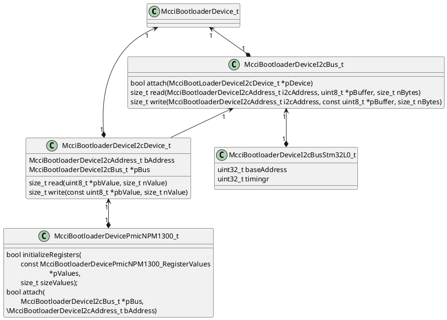

# platform/soc/stm32l0

STM32L0 SoC support for the MCCI Trusted Bootloader. Builds as the static
library `libmcci_bootloader_stm32l0` and provides the SoC-level pieces that
sit between the Cortex-M0+ architecture layer
([`platform/arch/cm0plus/`](../../arch/cm0plus/)) and the board layer
([`platform/board/`](../../board/)).

This library is hardware-independent of any particular board: it knows how
to drive STM32L0xx peripherals, but does not select pins, clocks, or board
identity. Boards consume this library through their own `.mk` files.

## Layout

```text
i/      Public headers (added to INCLUDES by the library .mk)
mk/     Library makefile
src/    Implementation
```

## Headers (`i/`)

- [`mcci_bootloader_stm32l0.h`](i/mcci_bootloader_stm32l0.h) -- public API
  surface for this library. Declares the entry points
  `McciBootloader_Stm32L0_systemInit()` and
  `McciBootloader_Stm32L0_prepareForLaunch()`, the system-flash driver
  callbacks (`...systemFlashErase`, `...systemFlashWrite`) used to fill in
  `McciBootloaderPlatform_Interface_t`, and the external reference to
  `gk_McciBootloader_CortexVectors` (the vector table is provided by the
  board layer).

- [`mcci_stm32l0xx.h`](i/mcci_stm32l0xx.h) -- register definitions for the
  STM32L0xx family. Written directly from the ST reference manual; we do
  not use CMSIS or the ST HAL. Covers the address map, RCC, FLASH, GPIO,
  SYSCFG, EXTI, PWR, SPI, I2C, USART, and the other peripherals the
  bootloader touches. Each register block is annotated with the section
  of the reference manual it came from.

## Sources (`src/`)

- [`mccibootloader_stm32l0_systeminit.c`](src/mccibootloader_stm32l0_systeminit.c)
  -- `McciBootloader_Stm32L0_systemInit()`. Brings the SoC up from reset
  state to the configuration the bootloader runs in: clock tree, flash
  wait states, basic GPIO/peripheral enables. Called early from the
  platform entry handler.

- [`mccibootloader_stm32l0_systemflash.c`](src/mccibootloader_stm32l0_systemflash.c)
  -- internal program-flash driver. Implements
  `McciBootloader_Stm32L0_systemFlashErase()` and
  `McciBootloader_Stm32L0_systemFlashWrite()`, which the board's platform
  interface installs as the SystemFlash callbacks. Programs the on-chip
  flash a half-page at a time via the helper
  `McciBootloader_Stm32L0_programHalfPage()`.

- [`mccibootloader_stm32l0_prepareforlaunch.c`](src/mccibootloader_stm32l0_prepareforlaunch.c)
  -- `McciBootloader_Stm32L0_prepareForLaunch()`. Quiesces SoC state
  (clocks, peripherals, interrupts) before the architecture layer
  transfers control to the application image, so the application starts
  in a clean, near-reset state.

- *I2C driver -- TBD.* Driver for the STM32L0 I2C peripheral, used on
  boards that need to talk to a PMIC (e.g. NPM1300 on the Catena 5230) or
  other I2C devices during boot. Documentation for the
  source files will be added when the driver lands.

  There is a strong family resemblance among I2C programming models across
  the STM32 family, but the controllers are not 100% compatible. In particular,
  the STM32L0 (like some others) has a specific `I2C_TIMINGR` timing register that must be initialized to a value that
  is both chip and (to some degree) board specific. On the other hand, the F4 I2C peripheral has no `I2C_TIMINGR` register. The `I2C_TIMINGR`
  value on the STM32L0 that we use is `0x10B07EBA`, which was chosen originally
  by ST (`@frederic.pillon`) for the NUCLEO-F091RC in 2017 and has been carried
  forward in MCCI's Arduino BSP since then.

  We expect that I2C will be needed in many bootloaders, so we plan an abstract
  I2C API that will be made concrete by a combination of #defines and static inline
  functions. The board level will instantiate the concrete driver by calling a
  concrete initialization function with parameters; the initialization function will return a handle. That
  handle will then be passed to concrete read and write functions that satisfy an
  abstract contract. As with the rest of the bootloader, the mapping will be made concrete at compile time
  (rather than deferring to link time using pointers as MCCI does in post-boot
  software). The I2C API will include (in essence) these methods:

  - `i2c::read(uint8_t target, uint8_t *pBuffer, size_t nBuffer) -> status`: read bytes and return success or failure.
  - `i2c::write(uint8_t target, const uint8_t *pBuffer, size_t nBuffer) -> status`: write bytes and return success or failure.

  Of course, in C, methods like `i2c::read` will turn into `read(self, ...)`. We've not yet determined whether `self` will be:

  - a pointer to a statically-allocated RAM object (allocated at compile time, initialized at run time, containing a pointer to the controller registers, configuration info, and run-time state);
  - a pointer to a const object (created and initialized at compile time, containing a pointer to the controller registers along with other configuration info);
  - just the pointer to the controller registers (implying that there's no configuration or run-time state beyond the register values); or
  - completely optimized out (implying that only one I2C controller is supported).

  The best guess is that it will be a pointer to the controller registers, as we don't currently know of a need for run-time state or configuration info after the controller is initialized.

## Build (`mk/`)

- [`libmcci_bootloader_stm32l0.mk`](mk/libmcci_bootloader_stm32l0.mk) --
  declares `libmcci_bootloader_stm32l0`, lists its sources and includes,
  and pulls in its prerequisite
  `platform/arch/cm0plus/mk/libmcci_bootloader_cm0plus.mk`. Built with
  `-Os`. The makefile uses an include guard so it is safe for multiple
  boards to include it.

## Notes on I2C Bus

We have `McciBootloaderPlatform_Interface_t` which has all the interfaces used by portable code. We use function pointers, true MCCI style. There's a `McciBootloaderPlatform_SpiInterface_t` which is a SPI bus interface; sort of a layering violation because the portable code doesn't directly use SPI; it makes the flash drivers potentially non-platform code (but in fact they live in `platform/driver`, so there's no reason except convenience for them to use the `McciBootloaderPlatform_Interface_t`).

For I2C we don't want to put the interface structure into the platform structure.



For this object hierarchy, we need to have a number of header files and the usual MCCI Russian doll series of nested structures.

For the moment, we won't touch the flash driver which is totally integrated into the platform object.

The initialization sequence will be:

1. The platform code first initializes the I2C bus driver used by the PMIC, and then initializes the PMIC driver passing the I2C bus driver and an address.
2. The platform code will provide some RAM (via a static allocation of the object to be used as `&ram`, and call `McciBootloader_Stm32L0Interface_InitI2cBus(&ram, sizeof(ram), busIndex, timin100k, timing400k, timing1MHz)` to get a bus interface handle (an `McciBootloaderDeviceI2cBus_t`)
3. The platform code then passes the bus interface handle to  `McciBootloaderDriver_PmicNPM1300_attach()`, along with the known I2C address of the PMIC.
4. The PMIC driver allocates memory for an `McciBootloaderDeviceI2cDevice_t` (embedded in the header of the `McciBootloaderDevice_PmicNPM1300_t`) and registers with the I2C bus driver, getting a suitable interface for doing low level I/Os
5. The platform calls `McciBootloaderDriver_PmicNPM1300_initializeRegisters()` which uses the bus driver to set up all the bytes in the PMIC. Note that the actual register values come from the platform. Our goal is not to operate the PMIC, just initialize it properly after a reset.

We also need to have code for prepareForExit. The only critical code is in the bus driver, which will need to restore the I2C controller registers to the initial state after hardware reset.

```c
void
McciBootloaderBoard_Catena5230_prepareForLaunch(void)
  {
  static McciBootloaderDeviceI2cBusStm32L0_t * const pI2cBus =
    &McciBootloaderBoard_Catena5230_i2cBus2;

  // shut down the PMIC
  if (g_McciBootloader_Device_pPmicNPM1300 != NULL)
    {
    g_McciBootloader_Device_pPmicNPM1300->Device.pMethods->pEndFn(
        &g_McciBootloader_Device_pPmicNPM1300->DeviceCast
        );
    g_McciBootloader_Device_pPmicNPM1300 = NULL;
    }

  // shut down the I2C driver and restore to reset state.
  pI2cBus->Device.pMethods->pEndFn(&pI2cBus->DeviceCast);

  // invoke the common launch function
  McciBootloaderBoard_Catena1sj_prepareForLaunch();
  }
```
