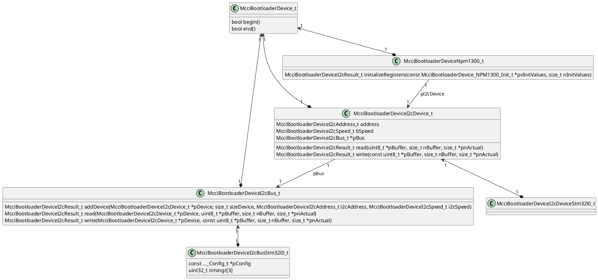

# platform/soc/stm32l0

STM32L0 SoC support for the MCCI Trusted Bootloader. Builds as the static
library `libmcci_bootloader_stm32l0` and provides the SoC-level pieces that
sit between the Cortex-M0+ architecture layer
([`platform/arch/cm0plus/`](../../arch/cm0plus/)) and the board layer
([`platform/board/`](../../board/)).

This library is hardware-independent of any particular board: it knows how
to drive STM32L0xx peripherals, but does not select pins, clocks, or board
identity. Boards consume this library through their own `.mk` files.

## Layout

```text
i/      Public headers (added to INCLUDES by the library .mk)
mk/     Library makefile
src/    Implementation
```

## Headers (`i/`)

- [`mcci_bootloader_stm32l0.h`](i/mcci_bootloader_stm32l0.h) -- public API
  surface for this library. Declares the entry points
  `McciBootloader_Stm32L0_systemInit()` and
  `McciBootloader_Stm32L0_prepareForLaunch()`, the system-flash driver
  callbacks (`...systemFlashErase`, `...systemFlashWrite`) used to fill in
  `McciBootloaderPlatform_Interface_t`, and the external reference to
  `gk_McciBootloader_CortexVectors` (the vector table is provided by the
  board layer).

- [`mcci_stm32l0xx.h`](i/mcci_stm32l0xx.h) -- register definitions for the
  STM32L0xx family. Written directly from the ST reference manual; we do
  not use CMSIS or the ST HAL. Covers the address map, RCC, FLASH, GPIO,
  SYSCFG, EXTI, PWR, SPI, I2C, USART, and the other peripherals the
  bootloader touches. Each register block is annotated with the section
  of the reference manual it came from.

## Sources (`src/`)

- [`mccibootloader_stm32l0_systeminit.c`](src/mccibootloader_stm32l0_systeminit.c)
  -- `McciBootloader_Stm32L0_systemInit()`. Brings the SoC up from reset
  state to the configuration the bootloader runs in: clock tree, flash
  wait states, basic GPIO/peripheral enables. Called early from the
  platform entry handler.

- [`mccibootloader_stm32l0_systemflash.c`](src/mccibootloader_stm32l0_systemflash.c)
  -- internal program-flash driver. Implements
  `McciBootloader_Stm32L0_systemFlashErase()` and
  `McciBootloader_Stm32L0_systemFlashWrite()`, which the board's platform
  interface installs as the SystemFlash callbacks. Programs the on-chip
  flash a half-page at a time via the helper
  `McciBootloader_Stm32L0_programHalfPage()`.

- [`mccibootloader_stm32l0_prepareforlaunch.c`](src/mccibootloader_stm32l0_prepareforlaunch.c)
  -- `McciBootloader_Stm32L0_prepareForLaunch()`. Quiesces SoC state
  (clocks, peripherals, interrupts) before the architecture layer
  transfers control to the application image, so the application starts
  in a clean, near-reset state.

- [`mccibootloader_stm32l0_i2c_bus.c`](src/mccibootloader_stm32l0_i2c_bus.c)
  -- STM32L0 I2C bus driver, used on boards that talk to a PMIC (the
  NPM1300 on the Catena 5230) or other I2C devices during boot. It makes
  concrete the abstract I2C bus contract from
  [`driver/i2c/`](../../../driver/i2c/) (`McciBootloaderDeviceI2cBus_t`):
  the `begin`/`end` device methods plus `addDevice`, `read`, and `write`.
  Board code creates a bus by calling
  `McciBootloader_Stm32L0Interface_initI2cBus()`; see
  "Notes on I2C Bus" below.

  There is a strong family resemblance among I2C programming models across
  the STM32 family, but the controllers are not 100% compatible. In particular,
  the STM32L0 (like some others) has a specific `I2C_TIMINGR` timing register that must be initialized to a value that
  is both chip and (to some degree) board specific. On the other hand, the F4 I2C peripheral has no `I2C_TIMINGR` register. The `I2C_TIMINGR`
  value on the STM32L0 that we use is `0x10B07EBA`, which was chosen originally
  by ST (`@frederic.pillon`) for the NUCLEO-F091RC in 2017 and has been carried
  forward in MCCI's Arduino BSP since then.

  The driver initializes three `I2C_TIMINGR` values (100 kHz, 400 kHz, and
  1 MHz), one per supported speed; the board passes them to `initI2cBus()`.
  A speed of `..._NOT_SUPPORTED` for 400 kHz or 1 MHz drops the device to the
  next lower supported speed.

  The abstract I2C API is made concrete with per-instance method tables of
  function pointers, dispatched at run time through those pointers, the same
  style MCCI uses in post-boot software. Static inline helpers upcast an
  abstract device back to its concrete object. In C the methods take `self`
  as the first argument.
  `self` is a pointer to a statically-allocated RAM object, allocated at
  compile time and initialized at run time: the bus object holds a pointer to
  its `pConfig` (register base address and RCC masks), the three timing
  values, and run-time status. Read and write take that bus object plus the
  target device object, and return a status code
  (`McciBootloaderDeviceI2cResult_t`); the count of bytes transferred comes
  back separately through `*pnActual`.

## Build (`mk/`)

- [`libmcci_bootloader_stm32l0.mk`](mk/libmcci_bootloader_stm32l0.mk) --
  declares `libmcci_bootloader_stm32l0`, lists its sources and includes,
  and pulls in its prerequisite
  `platform/arch/cm0plus/mk/libmcci_bootloader_cm0plus.mk`. Built with
  `-Os`. The makefile uses an include guard so it is safe for multiple
  boards to include it.

## Notes on I2C Bus

We have `McciBootloaderPlatform_Interface_t` which has all the interfaces used by portable code. We use function pointers, true MCCI style. There's a `McciBootloaderPlatform_SpiInterface_t` which is a SPI bus interface; sort of a layering violation because the portable code doesn't directly use SPI; it makes the flash drivers potentially non-platform code (but in fact they live in `platform/driver`, so there's no reason except convenience for them to use the `McciBootloaderPlatform_Interface_t`).

For I2C we don't want to put the interface structure into the platform structure.



The hierarchy uses the usual MCCI Russian-doll series of nested structures, so
it needs a number of header files. `begin` and `end` belong to the base
`McciBootloaderDevice_t`; clients call the framework wrappers
`McciBootloaderDevice_begin()` and `McciBootloaderDevice_end()` rather than the
raw `pBegin`/`pEnd` method pointers. The wrappers track a `fStarted` flag, skip
redundant begin/end calls, and refuse to operate on an uninitialized device.

An I2C device node (`McciBootloaderDeviceI2cDevice_t`) is the equivalent of a
Windows PDO: it carries the device's address, speed, and parent bus, and its
`read`/`write` methods just forward to the bus, which does the actual transfer.
Its `begin`/`end` methods are null; the framework behavior is enough.

For the moment, we don't touch the flash driver, which is fully integrated into
the platform object.

The initialization sequence, as done in
[`mccibootloaderboard_catena5230_systeminit.c`](../../board/mcci/catena5230/src/mccibootloaderboard_catena5230_systeminit.c),
is:

1. The platform statically allocates the bus object
   (`McciBootloaderDeviceI2cBusStm32l0_t`) and the PMIC's device object
   (`McciBootloaderDeviceI2cDeviceStm32l0_t`).
2. It calls
   `McciBootloader_Stm32L0Interface_initI2cBus(&bus, sizeof(bus), &config, timingr100k, timingr400k, timingr1M)`,
   which zeroes the object, installs the method tables, records the config and
   timing values, starts the controller (calls `begin`), and returns an
   `McciBootloaderDeviceI2cBus_t *`. Any error calls the platform fail handler.
   The board then configures the I2C pins (alternate function, open-drain,
   pull-up) itself.
3. It calls
   `McciBootloaderDevice_NPM1300_createAndAttach(pBus, &pmicDevice.I2cDeviceCast, sizeof(pmicDevice))`.
   The driver asks the bus to `addDevice` (which fills in the device object
   with the PMIC's fixed address `MCCI_PMIC_NPM1300_I2C_ADDRESS` (0x6B) at
   100 kHz and links it to the bus), begins the device, and returns a pointer
   to the statically-allocated `McciBootloaderDeviceNpm1300_t`. The PMIC
   address is fixed in the driver, not passed by the caller.
4. It calls
   `McciBootloaderDevice_NPM1300_initializeRegisters(pPmic, pmicInitTable, MCCIADK_LENOF(pmicInitTable))`
   to write the platform's register/value table
   (`McciBootloaderDevice_NPM1300_Init_t[]`) into the PMIC. The values come
   from the platform; the goal is to initialize the PMIC after reset, not to
   operate it. `storageInit` later enables the flash rail with a two-entry
   table (`LDSWLDOSEL_2`=0, `TASKLDSWSET_2`=1), waits 50 ms, then inits SPI
   and the flash.

Teardown before app launch, in `McciBootloaderBoard_Catena5230_prepareForLaunch()`:
it cuts SPI-flash power by writing `TASKLDSWCLR_2` (0x0803) through
`McciBootloaderDevice_NPM1300_writeRegister()`, then stops the PMIC and the I2C
bus with `McciBootloaderDevice_end()` (the bus `end` clears the I2C2 clock
enable), then delegates to the common Catena1SJ path, which calls
`McciBootloader_Stm32L0_prepareForLaunch()` to reset the remaining peripherals
and switch back to MSI. This keeps the PMIC's low-power init while cutting flash
power, deliberately different from restoring the PMIC to defaults.
